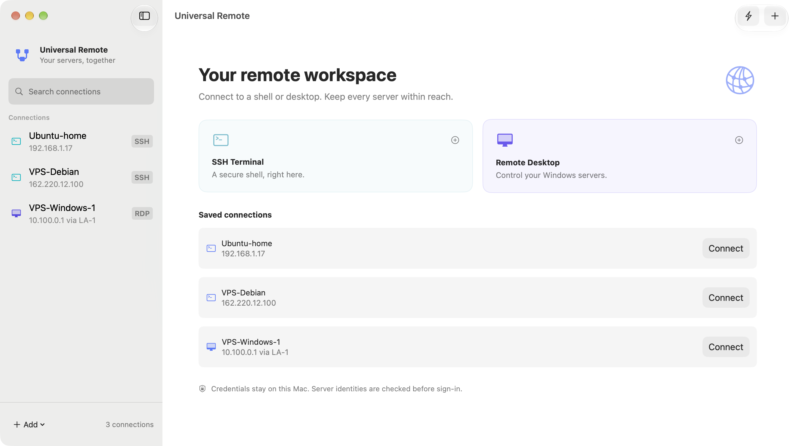
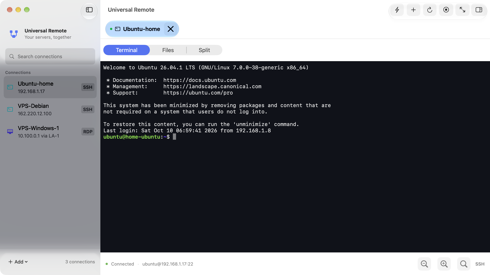
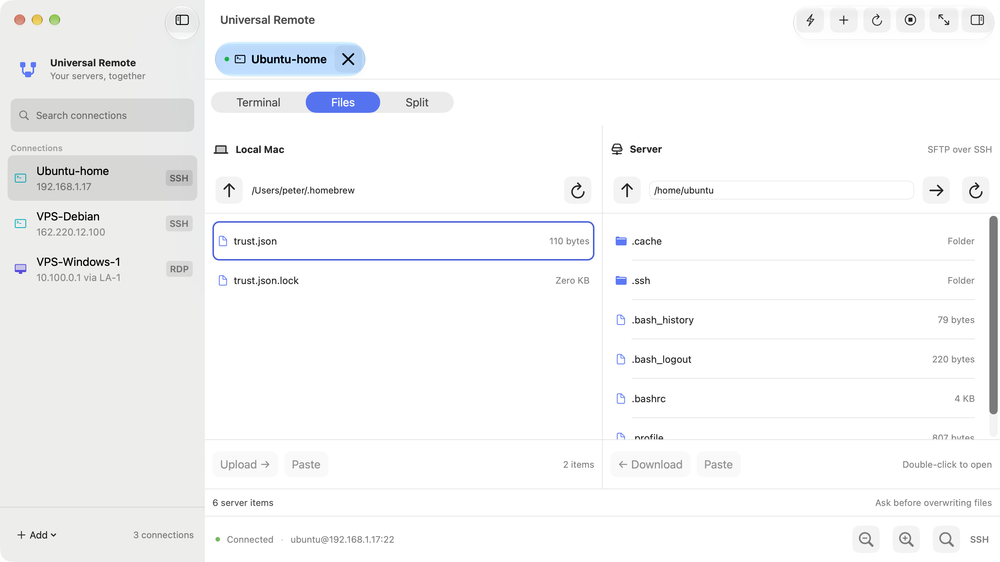
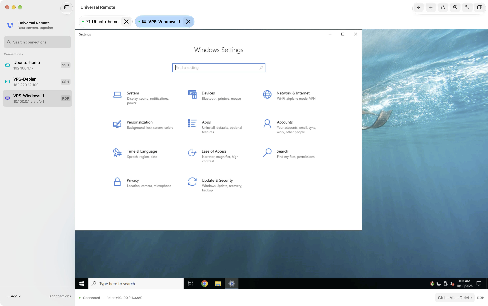
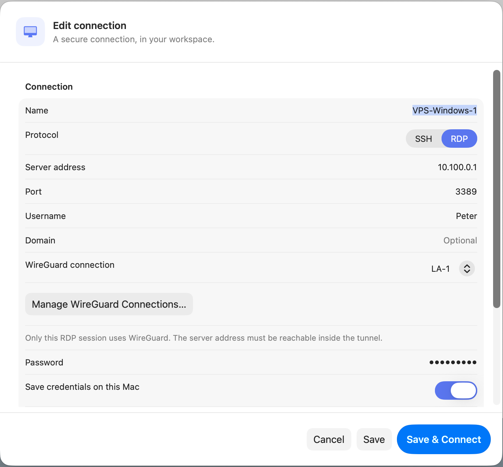

# Universal Remote


A native Mac workspace for SSH terminals, SFTP file transfers and RDP desktops.
Keep saved connections and active sessions together in a tabbed SwiftUI interface.

- **SSH & SFTP:** password, private-key or interactive sign-in; terminal and files share one connection.
- **Remote Desktop:** RDP with display options, optional text clipboard and remote sound.
- **Private servers:** optional embedded WireGuard connections for RDP.
- **Local storage:** saved profiles and credentials stay on your Mac.

Requires **macOS 27 or later and Apple silicon**. Protocol libraries are bundled;
users don't need Homebrew or a separate SSH, RDP or WireGuard client.
This is an early preview. Local builds are ad-hoc signed and unnotarized.

## Screenshots



**SSH terminal**



**SFTP file transfer**



**Remote desktop**



**Connection editor**



## Get started

Open Universal Remote, choose **SSH Terminal**, **Remote Desktop**, or **Quick Connect**,
and enter your server details. Verify an unfamiliar server fingerprint before signing in.
Save a profile for later or use Quick Connect for a single session.
See the [user guide](docs/user-guide.md) for file transfers, settings and shortcuts.

Credentials use Keychain when available. The development fallback stores them in
owner-only, **unencrypted local files**; saving screens explain this choice.

## Build from source

Install Xcode with the macOS SDK and Metal compiler, Git, CMake, Python 3 and Go 1.27+.
The first dependency build needs internet access.

```sh
brew install cmake  # If needed
xcodebuild -downloadComponent MetalToolchain  # If Xcode reports it missing
scripts/prepare-dependencies.sh
scripts/build.sh
open ".build/Xcode/Build/Products/Release/Universal Remote.app"
```

Or prepare dependencies, open `UniversalRemote.xcodeproj`, and Run. Allow the pinned
SwiftTerm build plugin if Xcode requests approval.
Dependency caches live in `.dependencies`, installed native libraries in `Vendor/Native`,
and disposable outputs in `.build`. You can clear `.build` between builds.

## More information

[Development & releases](docs/development.md) · [Testing](docs/testing.md) ·
[Architecture](docs/architecture.md) · [WireGuard](docs/wireguard.md) ·
[Validation & known limits](docs/validation.md) · [Agent guide](AGENTS.md)

Dependency versions and licenses are in [ThirdParty](ThirdParty/README.md).
The license for Universal Remote's own source is still undecided.
